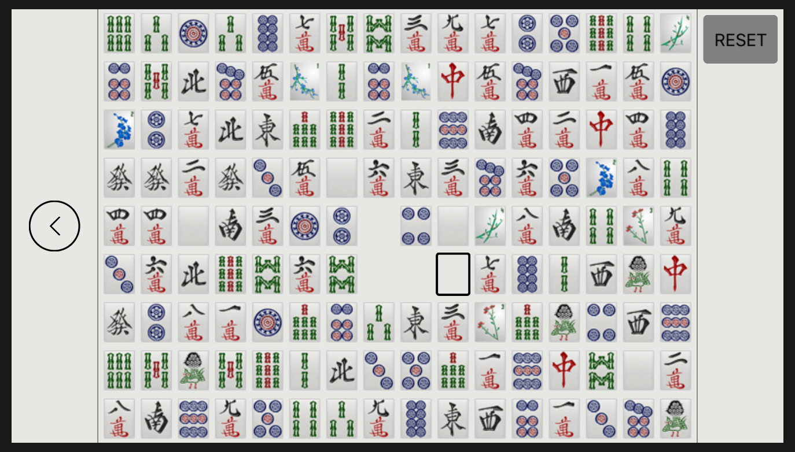

  <h3 class="project-header">Gemini, Personal Project</h3>

  

    <a style="margin:0 auto" href="https://github.com/BENJYI/Gemini/">
      Project URL
      
    </a>
  

  This game was inspired by a close friend who introduced me to this game while playing a game of Mahjong. Gemini is a puzzle game where the goal is to match two identical pieces per move until the board is emptied. The basic gameplay is as follows:
  1. Choose a tile.
  2. Move the tile and all leading tiles towards an empty area. We can also choose not to move at all.
  3. At the end of the move, if the selected tile can "see" an identical piece in any of four directions, then it can match with that piece. "Seeing" means no tiles exists between the selected tile and its twin. This means any two adjacent tiles that are identical can be matched.
  4. If no identical tiles are visible, then the movement is invalid and is reverted.

  

    

      

      • • •
      

    

  

  

    

      

        
      

      

        

          Start by matching adjacent pairs of tiles.
        

      

      
      

        

          
        

        

          
        

        

          
        

        

          
        

      

    

  

  

    

      

      • • •
      

    

  

  

    <h3 style="text-decoration:underline">Demo - iOS (Simulator)</h3>
    

      <object data="https://www.youtube.com/embed/e-fX8VSi2xM"></object>
    

  

  <h3 class="project-header">JPMorgan Chase, Code For Good, Hackathon</h3>

  

    <a style="margin:0 auto" href="https://github.com/brooklyn2016/team-21">
      Project URL
      
    </a>
  

  This first and only hackathon I ever attended was a special experience. Since I applied alone, I was placed in a randomly organized group with three other students. As a group, we had 24 hours to come up with a solution presented to us by the non-profit organization <a href="https://eden2.org/">Eden II</a>, a community that helps the autistic community by providing institutes, caretakers, and extracurricular programs for people of all ages. 

  The problem presented to us was that newly hired staff sometimes had difficulty understanding incoherent words spoken by clients. The solution we devised was an application which allowed caregivers to record audio and provide a specific definition for the sound pattern for an individual. This would be recorded into a database which other staff can reference when the problem occurs.

  We were able to share our skillsets to produce some kind of workflow. With some iOS development experience, I was able to provide the front-end and dispatch calls to a backend provided by my other team member. Unfortunately, 24 hours was not enough to fully implement what we had envisioned. But, this was a learning experience for all of us as it was our first hackathon ever. I hope to soon register for another hackathon to see what improvements I've made as a student.

  <h3 class="project-header">CISC 3320, Operating Systems, Group Project</h3>

  

    <a style="margin:0 auto" href="https://github.com/CISC3320SP19/cisc3320proj3-jabytz">
      Project URL (Private)
      
    </a>
  

  The program created for this project measured the cost of a context switch by recording the time it took for two processors to calculate the sum of integers in a very large array. The inspiration for this project was a similar research done by Li, Ding, and Shen, whose research can be found in the USENIX database <a href="https://www.usenix.org/legacy/events/expcs07/papers/2-li.pdf">here</a>. Using the sched and pthread library, we were able to observe the advantages of multicore processing as the workload increased, while observing performance losses when workload decreased when comparing to work done by a single processor.

  <h3 class="project-header">CISC 3171, Software Engineering, Group Project</h3>

  

    <a style="margin:0 auto" href="https://github.com/BENJYI/too_many_cooks">
      Project URL
      
    </a>
  

  Too Many Cooks was final team project for my Software Engineering course. We were required to create specifications in the form of a system design report, which is viewable in the repository <a href="https://github.com/BENJYI/too_many_cooks/blob/master/SDR.pdf">here</a>. To build the product, we use Ruby on Rails, which was the perfect framework to build both the frontend and backend without having to everything from scratch. 

  The final product had a login system with authentication allowing a user to function as a customer, chef, delivery personnel, or a manager, each having unique functionality - customers can order food, chefs can produce the orders, delivery personnel can delivery the orders, and managers can hire or fire employees.

  This group project was an extremely valuable experience as I was required to work with both the front-end and back-end and also use Git for version control heavily for the first time. Although the end product might need some UI makeup, much of the functionality mentioned in the system design report was fully implemented.

  

    

      

      • • •
      

    

  

  

    

      

        
      

      
      

        

          
        

        

          
        

        

          
        

        

          
        

      

    

  

