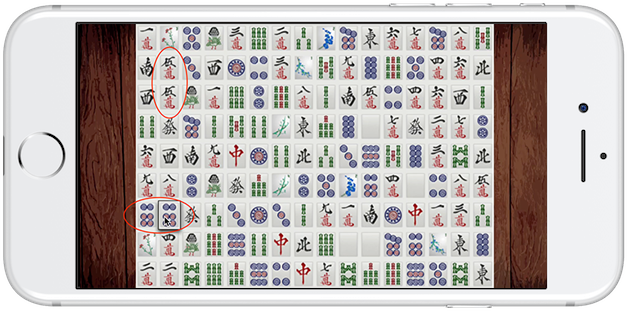
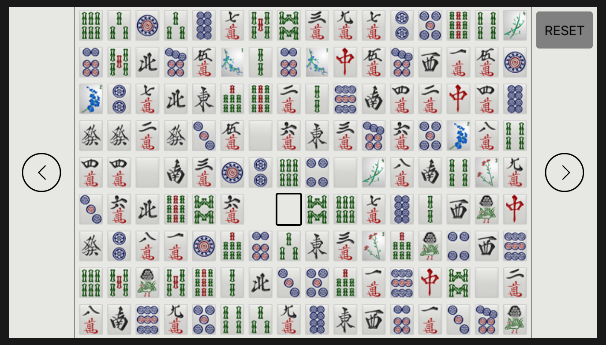
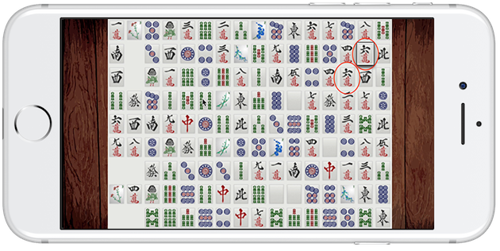
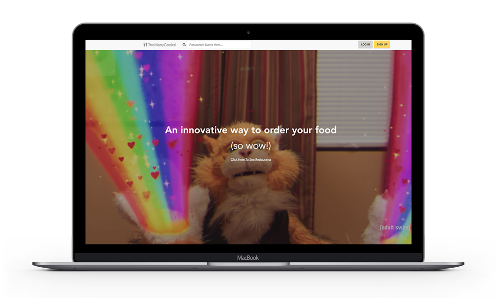
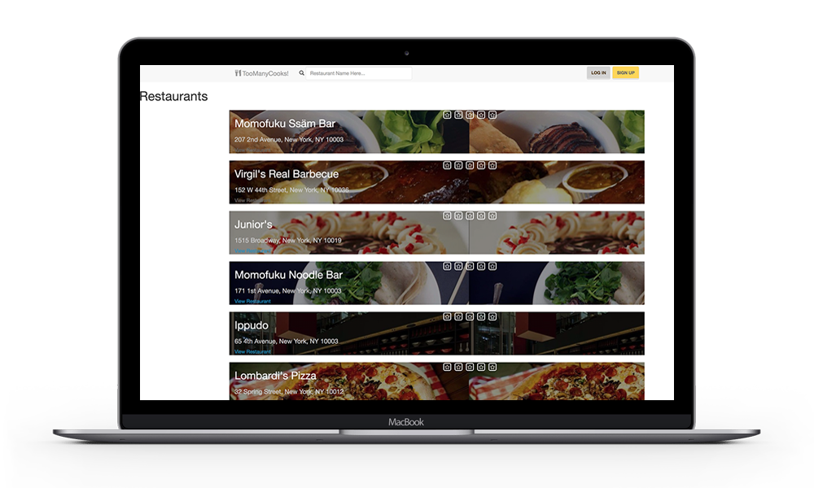
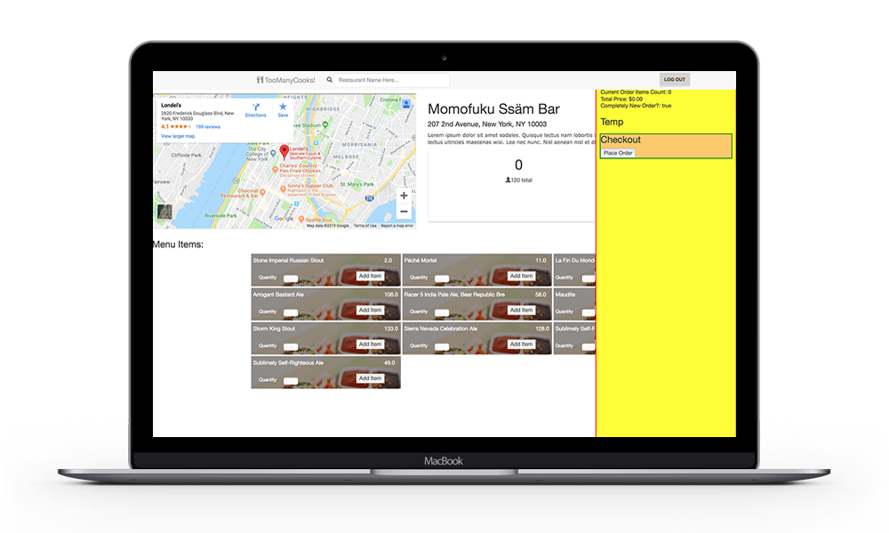
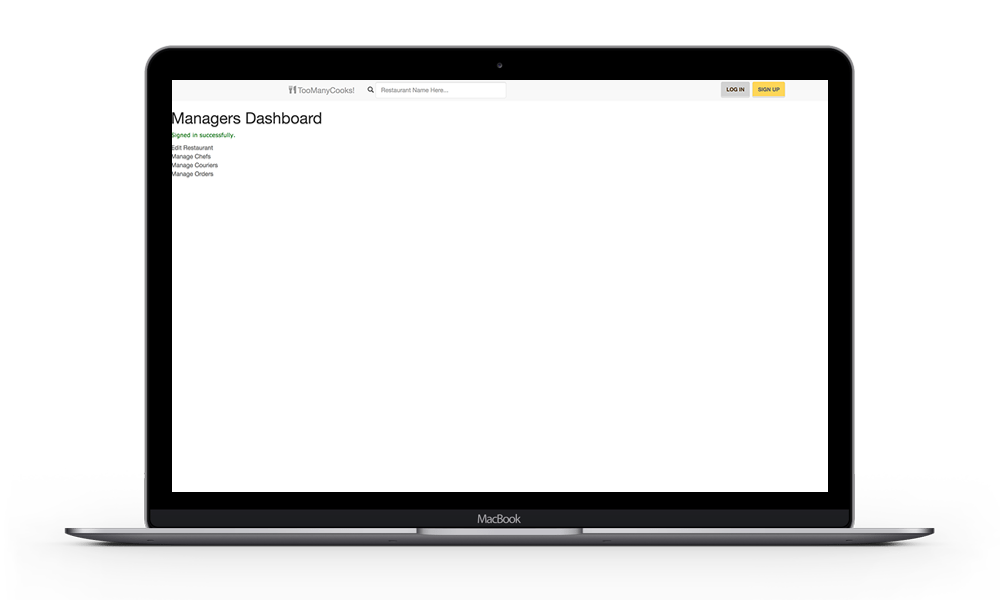

## Gemini - iOS Mobile Game

Repository: [https://github.com/BENJYI/Gemini/](https://github.com/BENJYI/Gemini)

A set of Mahjong tiles - 144 pieces - are laid out on the board as a 16x9 grid. The player must match two identical tiles given the following set of rules:
1. Two tiles can be matched if no other tiles are in between the two tiles. So, adjacent tiles can always be matched.
2. If a tile a "matched", they are removed from the board.
3. A tile can be used as a focal point to push a group of tiles through empty space on the board, as long as that tile can be matched.
4. If the tile is matched, the remaining displaced tiles are given their new positions. Otherwise, the displacement is reversed.

---

## Too Many Cooks - Web Application

Repository: [https://github.com/BENJYI/too_many_cooks](https://github.com/BENJYI/too_many_cooks)

This was a final team project for my Software Engineering course. The goal of the project was to display practical knowledge of entity-relationship and use case models by creating a food delivery system with proper documentation. To create both ends, we used Rails to scaffold the project. The final product had a login system with authentication allowing a user to function as a customer, chefs, delivery personnel, or a manager, each with some unique functionality - customers can order food, chefs can produce orders, delivery personnel can delivery orders, and managers can hire or fire employees. For documentation, we wrote a system design report, which is viewable in the repository or <a href="https://github.com/BENJYI/too_many_cooks/blob/master/SDR.pdf">here</a>.

---

## JPM Chase Code for Good Hackathon - iOS Mobile Application

Repository: [https://github.com/brooklyn2016/team-21](https://github.com/brooklyn2016/team-21)

In this Hackathon, several non-profit organizations presented problems that needed solving. As a randomly organized group of four student, we had 24-hours to produce a strategy which solved one of these problems. We chose to create a mobile application for the organization <a href="https://eden2.org/">Eden II</a>, which helped the autistic community through several extra-curricular programs. The application functioned as a medium of communication between caretakers and clients who sometimes used unrecognizable words. The app allowed a caretaker to record the word, and match an image in accordance to a unique client's definition and then save it to a larger database of "client-words".
