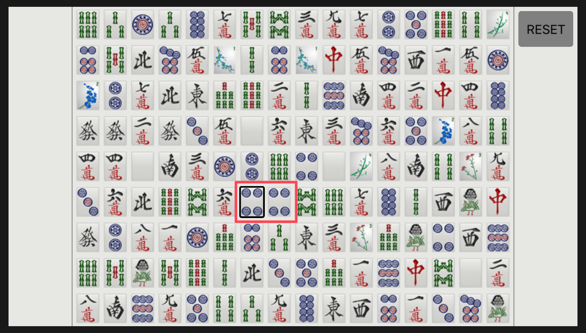
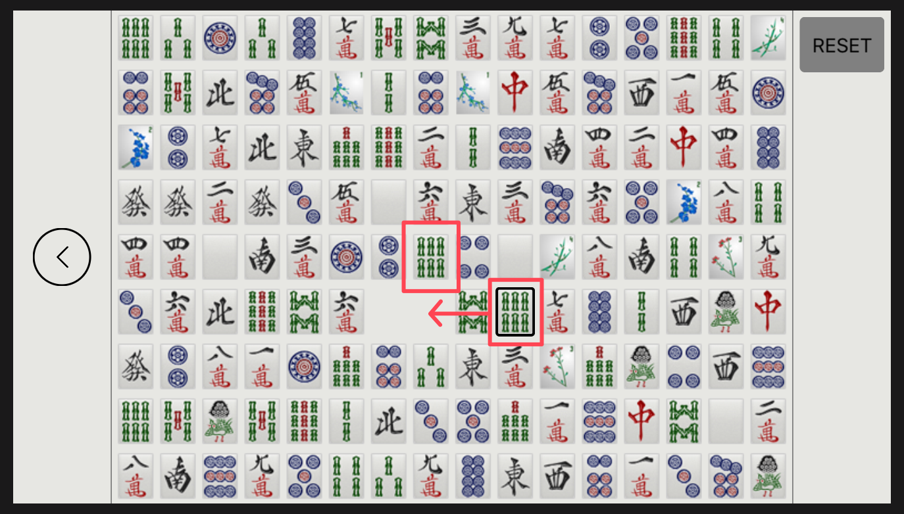

## JPM Chase Code for Good Hackathon - iOS Mobile Application

Project description.

---

## Too Many Cooks - Web Application

Project description.

---

## Gemini - iOS Mobile Game

Repository: [https://github.com/BENJYI/Gemini/](https://github.com/BENJYI/Gemini)

A set of Mahjong tiles - 144 pieces - are laid out on the board as a 16x9 grid. The player must match two identical tiles given the following set of rules:
1. Two tiles can be matched if no other tiles are in between the two tiles. So, adjacent tiles can always be matched.
2. If a tile a "matched", they are removed from the board.
3. A tile can be used as a focal point to push a group of tiles through empty space on the board, as long as that tile can be matched.
4. If the tile is matched, the remaining displaced tiles are given their new positions. Otherwise, the displacement is reversed.

